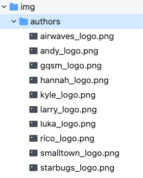
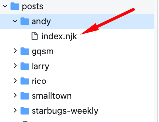
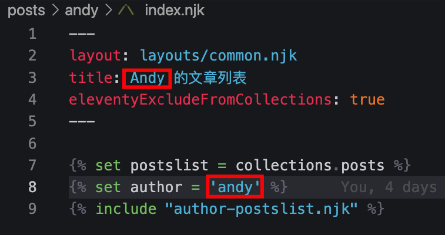
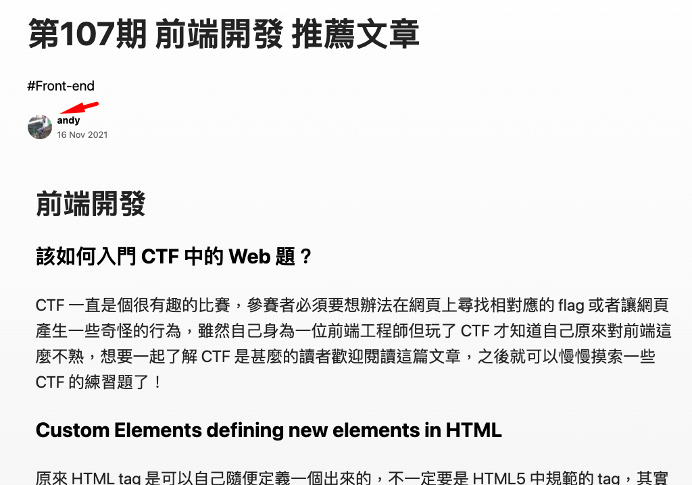

# StarBugs Weekly

Website: https://weekly.starbugs.dev/

## Contribution

### Contribute recommend article

1. fork a current repository to your account
2. create a new issue via an issue template
3. add a new file to directory `posts/starbugs-weekly/contribution`

### Contribute an activity

1. fork a current repository to your account
2. create a new issue via an issue template
3. add a new file to directory `posts/starbugs-weekly/activities`

### First-time contribution

If you contribute this repo first-time, you should add information to `metadata.json` to keep the article working fine.

```json
  ...
  "contributors": {
    "starbugs": {
      "name": "starbugs",
      "intro": "星巴哥技術週刊",
      "avatarUrl": "/img/authors/starbugs_logo.png",
      "site": "https://weekly.starbugs.dev/"
    }
  },
  ...
```

Add your avatar to `img/authors`. 



create a personal post template for yourself



modify the name



Then the avatar should work on a post list, a post page, and the about page.




## Development

```
npm install
npm run watch
```

## Deployment 

Deployment is trigger by release.

## Reference

- [Eleventy Documentation](https://www.11ty.dev/docs/collections/)
- [Nunjucks template document](https://mozilla.github.io/nunjucks/templating.html)

## the project forks from the following projects: 

- [Cymetrics Tech Blog](https://github.com/cymetrics/blog)
- [error-baker-blog](https://github.com/Lidemy/error-baker-blog) 
- [eleventy-high-performance-blog](https://github.com/google/eleventy-high-performance-blog)
